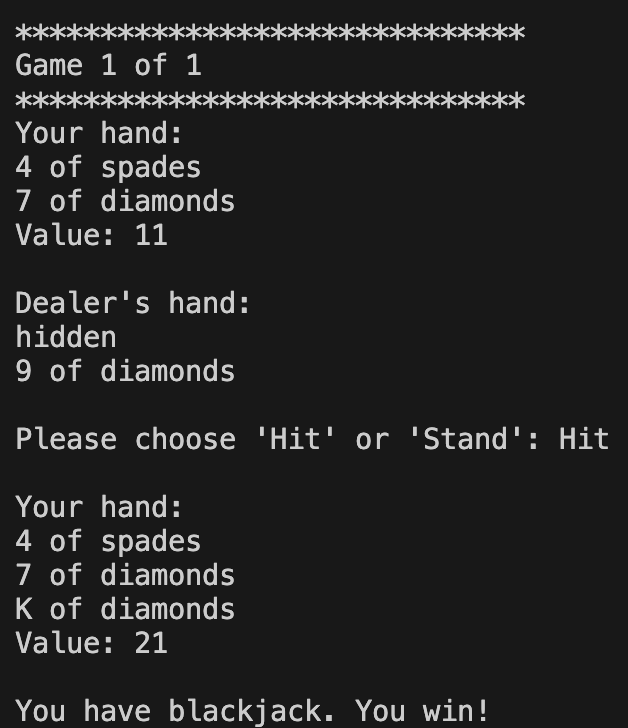

# Blackjack-Project

This is a simple Blackjack game played inside the Terminal.

## Table of contents

- [Overview](#overview)
  - [The challenge](#the-challenge)
  - [Screenshot](#screenshot)
- [My process](#my-process)
  - [Built with](#built-with)
  - [What I learned](#what-i-learned)
  - [Continued development](#continued-development)
- [Author](#author)

## Overview

### The challenge

Users should be able to:

- Play the game by typing commands into the terminal
- Receive an output of
  - Their current hand
  - The Dealer's hand
  - The option to hit or stand
  - Who wins

### Screenshot



## My process

### Built with

- Python
- Visual Studio Code
- PyCharm

### What I learned

While working through this project, some of my major learnings were implementing object oriented practices and defining several functions that play an important role in the game. By creating the deck class where each suit is in a list and their respective ranks are in a list of key-value pairs containing ranks and values, I was able to simulate a standard deck of playing cards used to play the game.

```python
class Deck:
    def __init__(self): #self represents the instance of the class
        self.cards = []
        suits = ["spades", "clubs", "hearts", "diamonds"]
        ranks = [
            {"rank": "A", "value": 11},
            {"rank": "2", "value": 2},
            {"rank": "3", "value": 3},
            {"rank": "4", "value": 4},
            {"rank": "5", "value": 5},
            {"rank": "6", "value": 6},
            {"rank": "7", "value": 7},
            {"rank": "8", "value": 8},
            {"rank": "9", "value": 9},
            {"rank": "10", "value": 10},
            {"rank": "J", "value": 10},
            {"rank": "Q", "value": 10},
            {"rank": "K", "value": 10},
        ]
        for suit in suits:
            for rank in ranks:
                self.cards.append(Card(suit, rank))
```

### Continued development

In future projects, I would focus more on object oriented practices and how I can take this project to the next level by including more visual elements where each card can be seen by the user.

## Author

### Danny Yu
